---
## Front matter
title: "Лабораторная работа No1. "
subtitle: "Основы интерфейса командной строки ОС GNU Linux"
author: "Арсоева Залина НБИбд-01-21"

## Generic otions
lang: ru-RU
toc-title: "Содержание"

## Bibliography
bibliography: bib/cite.bib
csl: pandoc/csl/gost-r-7-0-5-2008-numeric.csl

## Pdf output format
toc: true # Table of contents
toc-depth: 2
lof: true # List of figures
lot: true # List of tables
fontsize: 12pt
linestretch: 1.5
papersize: a4
documentclass: scrreprt
## I18n polyglossia
polyglossia-lang:
  name: russian
  options:
	- spelling=modern
	- babelshorthands=true
polyglossia-otherlangs:
  name: english
## I18n babel
babel-lang: russian
babel-otherlangs: english
## Fonts
mainfont: PT Serif
romanfont: PT Serif
sansfont: PT Sans
monofont: PT Mono
mainfontoptions: Ligatures=TeX
romanfontoptions: Ligatures=TeX
sansfontoptions: Ligatures=TeX,Scale=MatchLowercase
monofontoptions: Scale=MatchLowercase,Scale=0.9
## Biblatex
biblatex: true
biblio-style: "gost-numeric"
biblatexoptions:
  - parentracker=true
  - backend=biber
  - hyperref=auto
  - language=auto
  - autolang=other*
  - citestyle=gost-numeric
## Pandoc-crossref LaTeX customization
figureTitle: "Рис."
tableTitle: "Таблица"
listingTitle: "Листинг"
lofTitle: "Список иллюстраций"
lotTitle: "Список таблиц"
lolTitle: "Листинги"
## Misc options
indent: true
header-includes:
  - \usepackage{indentfirst}
  - \usepackage{float} # keep figures where there are in the text
  - \floatplacement{figure}{H} # keep figures where there are in the text
---

# Цель работы

Приобретение практических навыков общения с операционной системой на уровне командной строки (организация файловой системы, навигация по файловой системе, создание и  удаление файлов и директорий).

# Выполнение лабораторной работы

1. Используя команду pwd, узнаем полный путь к домашней директории.(рис. [-@fig:001])

{ #fig:001 width=70% }

2. Вводим следующую последовательность команд:
cd
mkdir tmp
cd tmp
pwd
cd /tmp
pwd
Необходимо понимать, что именно мы делаем. Мы перешли в домашний каталог, там создали пустой каталог tap. (На компьютере уже был каталог tmp, поэтому пришлось использовать другое имя для каталога.) После этого мы переходим в каталог tap и оттуда уже просматриваем полный путь к этому каталогу. (рис. [-@fig:002])

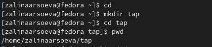{ #fig:002 width=70% }

Тут выдаётся ошибка, потому что мы упустили ~, таким образом мы по умолчанию работаем в домашнем каталоге. А написано требовало полный путь в tap из домашнего каталога. (рис. [-@fig:003])

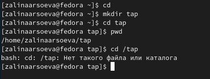{ #fig:003 width=70% }

Пример правильного запроса.(рис. [-@fig:004])

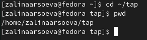{ #fig:004 width=70% }

3. Пользуясь командами cd и ls, смотрим содержимое корневого каталога,(рис. [-@fig:005])

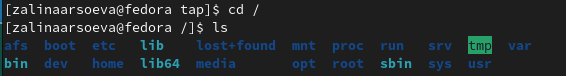{ #fig:005 width=70%} 

домашнего каталога, (рис. [-@fig:006)

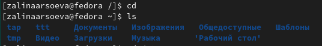{ #fig:006 width=70% }

каталогов /etc(рис. [-@fig:007])

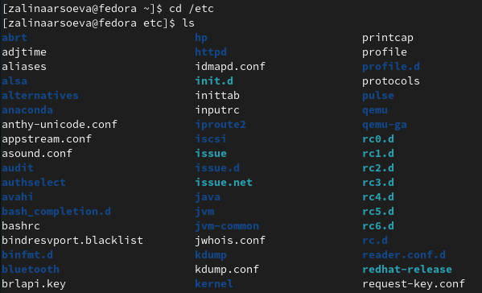{ #fig:007 width=70% }

и /usr/local.(рис. [-@fig:008])

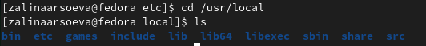{ #fig:008 width=70% }

4. Используя изученные консольные команды, в своём домашнем каталоге создаем каталог temp и каталог labs с подкатологами lab1, lab2 и lab3 одной командой.(рис. [-@fig:009])

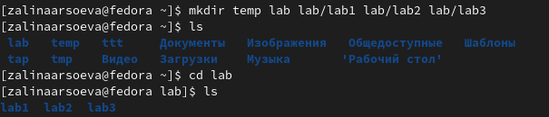{ #fig:009 width=70% }

В каталоге temp создаем файлы text1.txt,text2.txt,text3.txt. Пользуясь командой ls, проверяем, что все действия выполнены успешно (каталоги и файлы созданы).(рис. [-@fig:010])

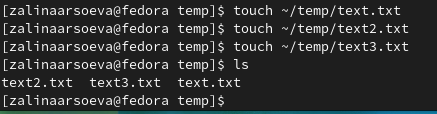{ #fig:010 width=70% }

5. C помощью текстового редактора mcedit записываем в файл text1.txt свое имя, в файл text2.txt фамилию, в файл text3.txt учебную группу.
Так как этот редактор не был установлен, пришлось ещё скачивать его.
(рис. [-@fig:011])(рис. [-@fig:012])(рис. [-@fig:013])

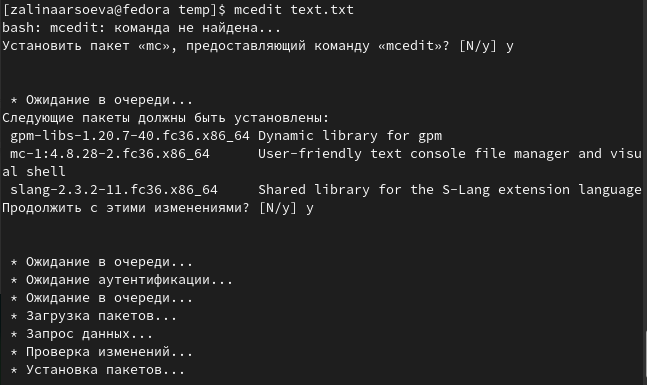{ #fig:011 width=70% }

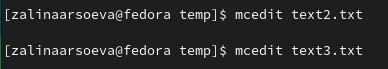{ #fig:012 width=70% }

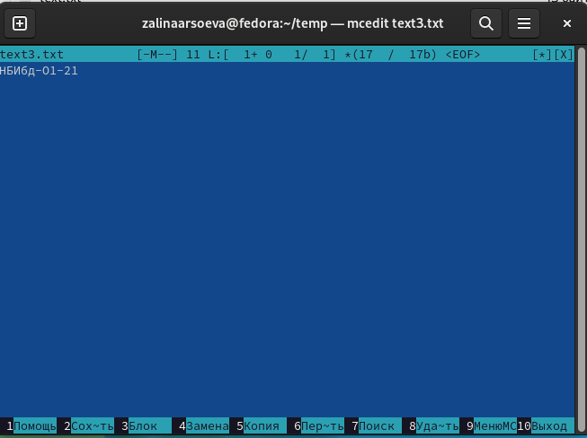{ #fig:013 width=70% }

 Выводим на экран содержимое файлов, используя команду cat.
Так как первый файл записан без 1 в названии, компьютер считает его последним.
(рис. [-@fig:014])

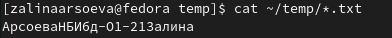{ #fig:014 width=70% }

1. Скопируем все файлы, чьи имена заканчиваются на .txt, из каталога ~/temp в каталог labs. И проверяем результат, что файлы именно скопировались.  (рис. [-@fig:015])

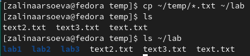{ #fig:015 width=70% }

После этого переименуем файлы каталога labs и переместим их: 
text1.txt переименуем в firstname.txt и переместим в подкаталог lab1,(рис. [-@fig:016])

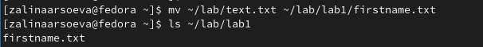{ #fig:016 width=70% }

text2.txt в lastname.txt в подкаталог lab2,(рис. [-@fig:017])

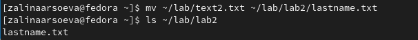{ #fig:017 width=70% }

text3.txt в id-group.txt в подкаталог lab3.(рис. [-@fig:018])

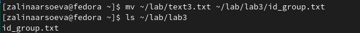{ #fig:018 width=70% }

 Пользуясь командами ls и cat, убедитесь, что все действия выполнены верно и файлы переместились. (рис. [-@fig:019])(рис. [-@fig:020])

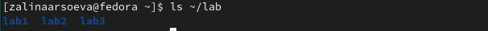{ #fig:019 width=70% }

{ #fig:020 width=70% }

# Выводы

В ходе выполнения данной лабораторной работы мы приобрели необходимые практические навыки работы с ОС на уровне командной строки. 

