---
## Front matter
title: "Лабораторная работа №2"
subtitle: "Система контроля версий Git"
author: "Арсоева Залина НБИбд-01-21"

## Generic otions
lang: ru-RU
toc-title: "Содержание"

## Bibliography
bibliography: bib/cite.bib
csl: pandoc/csl/gost-r-7-0-5-2008-numeric.csl

## Pdf output format
toc: true # Table of contents
toc-depth: 2
lof: true # List of figures
lot: true # List of tables
fontsize: 12pt
linestretch: 1.5
papersize: a4
documentclass: scrreprt
## I18n polyglossia
polyglossia-lang:
  name: russian
  options:
	- spelling=modern
	- babelshorthands=true
polyglossia-otherlangs:
  name: english
## I18n babel
babel-lang: russian
babel-otherlangs: english
## Fonts
mainfont: PT Serif
romanfont: PT Serif
sansfont: PT Sans
monofont: PT Mono
mainfontoptions: Ligatures=TeX
romanfontoptions: Ligatures=TeX
sansfontoptions: Ligatures=TeX,Scale=MatchLowercase
monofontoptions: Scale=MatchLowercase,Scale=0.9
## Biblatex
biblatex: true
biblio-style: "gost-numeric"
biblatexoptions:
  - parentracker=true
  - backend=biber
  - hyperref=auto
  - language=auto
  - autolang=other*
  - citestyle=gost-numeric
## Pandoc-crossref LaTeX customization
figureTitle: "Рис."
tableTitle: "Таблица"
listingTitle: "Листинг"
lofTitle: "Список иллюстраций"
lotTitle: "Список таблиц"
lolTitle: "Листинги"
## Misc options
indent: true
header-includes:
  - \usepackage{indentfirst}
  - \usepackage{float} # keep figures where there are in the text
  - \floatplacement{figure}{H} # keep figures where there are in the text
---

# Цель работы

Целью работы является изучить идеологию и применение средств контроля версий. Приобрести практические навыки по работе с системой git.

# Выполнение лабораторной работы

1.  Настраиваем github. Создаем учётную запись на сайте https://github.com/.(рис. [-@fig:001])

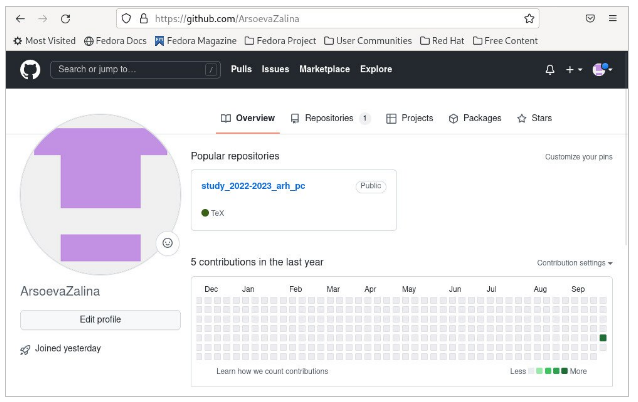{ #fig:001 width=70% }

2. Сначала сделаем предварительную конфигурацию git. Открываем терминал и вводим следующие команды, указав имя и email:

**git config --global user.name "<Name Surname>"**
**git config --global user.email "<work@mail>"** 

Настроим utf-8 в выводе сообщений git:

**git config --global core.quotepath false**

Зададим имя начальной ветки (будем называть её master):

**git config --global init.defaultBranch master**

Параметр autocrlf:

**git config --global core.autocrlf input**

Параметр safecrlf:

**git config --global core.safecrlf warn** 
(рис. [-@fig:002])

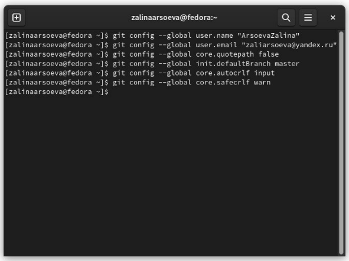{ #fig:002 width=70% }

3. Создание SSH ключа. Для последующей идентификации пользователя на сервере репозиториев сгенерируем пару ключей (приватный и открытый):

**ssh-keygen -C "Имя Фамилия <work@mail>"**

Ключи сохраняться в каталоге ~/.ssh/

Скопировав из локальной консоли ключ в буфер обмена

**cat ~/.ssh/id_rsa.pub | xclip -sel clip** (рис. [-@fig:003])(рис. [-@fig:004])

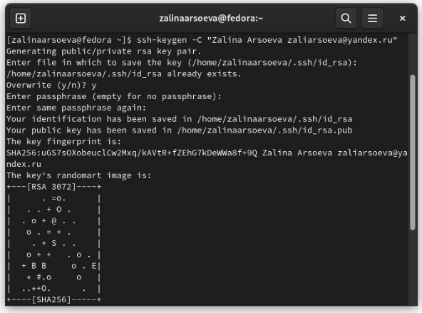{ #fig:003 width=70% }

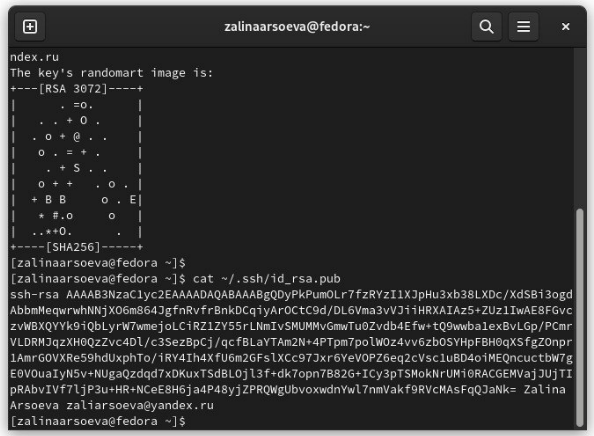{ #fig:004 width=70% }
  
Далее загружаем сгенерённый открытый ключ. Для этого заходим на сайт http://github org/ под своей учётной записью и переходим в меню Setting. После этого выбрать в боковом меню SSH and GPG keys и нажать кнопку New SSH. (рис. [-@fig:005])

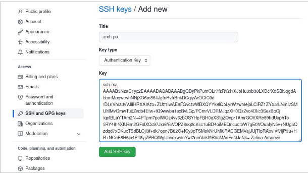{ #fig:005 width=70% }

В итоге у нас теперь есть SSH Keys с названием arch-pc. (рис. [-@fig:006])

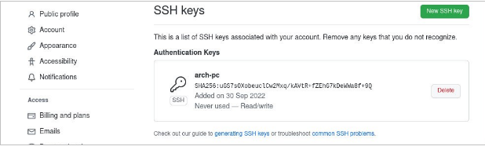{ #fig:006 width=70% }

4. Создаем рабочее пространство и репозиторий курса на основе шаблона.
В терминале создаем каталог для предмета «Архитектура компьютера»:

**mkdir -p ~/work/study/2022-2023/"Архитектура компьютера"** (рис. [-@fig:001])

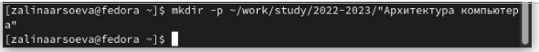{ #fig:007 width=70% }

5. Создаем репозиторий курса на основе шаблона

Репозиторий на основе шаблона создаем на github. Переходим на страницу репозитория с шаблоном курса https://github.com/yamadharma/course-directory-student-template. Далее выбераем Use this template. 

В открывшемся окне задаем имя репозитория (Repository name) study_2022–2023_arh-pc и создайте репозиторий (кнопка Create repository from template).

Готовый репозиторий: (рис. [-@fig:008])

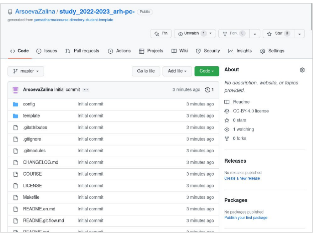{ #fig:008 width=70% }

Открываем терминал и переходим в каталог курса:

**cd ~/work/study/2022-2023/"Архитектура компьютера"**(рис. [-@fig:009])

{ #fig:009 width=70% }

клонируем созданный репозиторий:

**git clone --recursive git@github.com:<user_name>/study_2022–2023_arh-pc.git arch-pc**

Ссылку для клонирования можно скопировать на странице созданного репозитория Code -> SSH:

 **git@github.com:ArsoevaZalina/study_2022-2023_arh-pc-.git ** (рис. [-@fig:010])(рис. [-@fig:011])

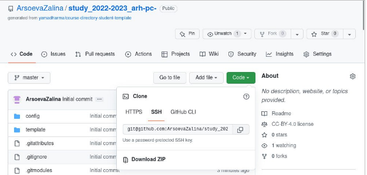{ #fig:010 width=70% }

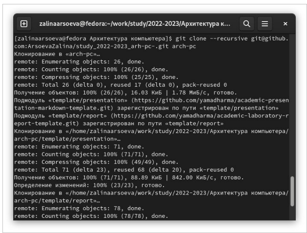{ #fig:011 width=70% }

6. Настройка каталога курса. 

Переходим в каталог курса:

**cd ~/work/study/2022-2023/"Архитектура компьютера"/arch-pc**

Удаляем лишние файлы:

**rm package.json**

Создаем необходимые каталоги:

**echo arch-pc > COURSE**

**make**

Отправляем файлы на сервер:

**git add .**
**git commit -am 'feat(main): make course structure'**
**git push** (рис. [-@fig:012])(рис. [-@fig:013])(рис. [-@fig:014])

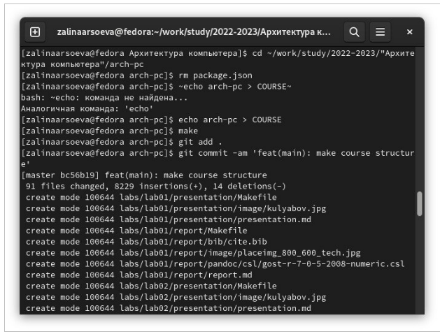{ #fig:012 width=70% }

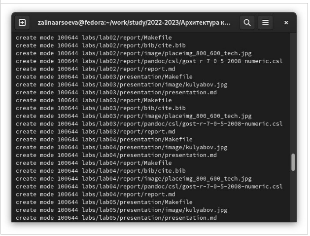{ #fig:013 width=70% }
  
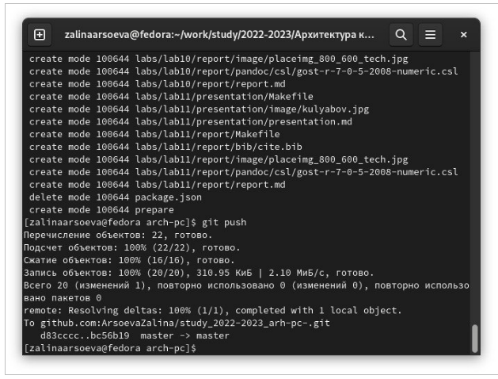{ #fig:014 width=70% }

Проверяем правильность создания иерархии рабочего пространства в репозитории на транице github: (рис. [-@fig:0015)

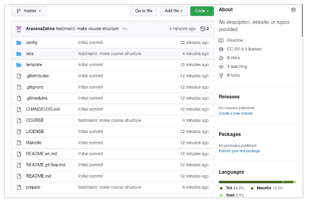{ #fig:015 width=70% }

Задание для самостоятельной работы
1. Создадим отчет по выполнению лабораторной работы в соответствующем каталоге рабочего пространства (labs>lab03>report).
Сразу открываем терминал в каталоге arch_pc. 
Создаём пустой текстовый файл с названием  репорт. (рис. [-@fig:016])

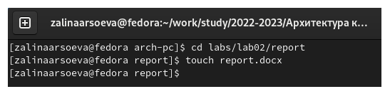{ #fig:016 width=70% }

Наполняем его информацией. Аналогичные действия повторяем и с 1 лабораторной работой. (рис. [-@fig:017])

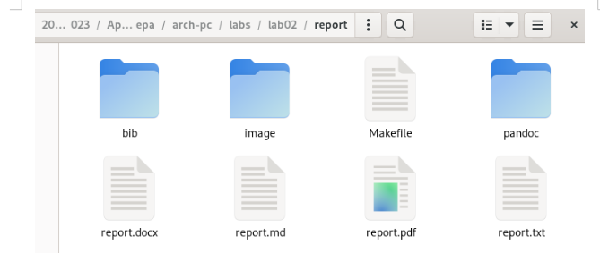{ #fig:017 width=70% }

2. Скопируем отчет по выполнению предыдущей лабораторной работы в соответствующие каталоги созданного рабочего пространства.

3. Загрузим файлы на github командами.
**Git add .**
**Git commit -am `1and2lab`**
**git push** (рис. [-@fig:018])

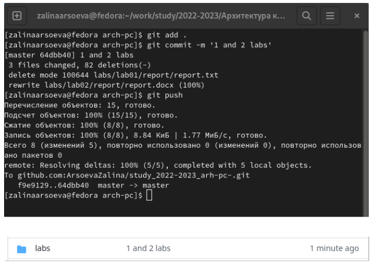{ #fig:018 width=70% }

# Выводы

Вывод: мы изучили идеологию и применение средств контроля версий. Приобрели практические навыки по работе с системой гит
