---
## Front matter
title: " Лабораторная работа No4."
subtitle: "Создание и процесс обработки программ на языке ассемблера NASM"
author: "Арсоева Залина НБИбд-01-21
## Generic otions
lang: ru-RU
toc-title: "Содержание"

## Bibliography
bibliography: bib/cite.bib
csl: pandoc/csl/gost-r-7-0-5-2008-numeric.csl

## Pdf output format
toc: true # Table of contents
toc-depth: 2
lof: true # List of figures
lot: true # List of tables
fontsize: 12pt
linestretch: 1.5
papersize: a4
documentclass: scrreprt
## I18n polyglossia
polyglossia-lang:
  name: russian
  options:
	- spelling=modern
	- babelshorthands=true
polyglossia-otherlangs:
  name: english
## I18n babel
babel-lang: russian
babel-otherlangs: english
## Fonts
mainfont: PT Serif
romanfont: PT Serif
sansfont: PT Sans
monofont: PT Mono
mainfontoptions: Ligatures=TeX
romanfontoptions: Ligatures=TeX
sansfontoptions: Ligatures=TeX,Scale=MatchLowercase
monofontoptions: Scale=MatchLowercase,Scale=0.9
## Biblatex
biblatex: true
biblio-style: "gost-numeric"
biblatexoptions:
  - parentracker=true
  - backend=biber
  - hyperref=auto
  - language=auto
  - autolang=other*
  - citestyle=gost-numeric
## Pandoc-crossref LaTeX customization
figureTitle: "Рис."
tableTitle: "Таблица"
listingTitle: "Листинг"
lofTitle: "Список иллюстраций"
lotTitle: "Список таблиц"
lolTitle: "Листинги"
## Misc options
indent: true
header-includes:
  - \usepackage{indentfirst}
  - \usepackage{float} # keep figures where there are in the text
  - \floatplacement{figure}{H} # keep figures where there are in the text
---

# Цель работы

Освоение процедуры компиляции и сборки программ, написанных на ассемблере NASM

# Задание

1. Создайте каталог для работы с программами на языке ассемблера NASM:

**mkdir ~/work/arch-pc/lab05**

2. Перейдите в созданный каталог

**cd ~/work/arch-pc/lab05**

3. Создайте текстовый файл с именем hello.asm

**touch hello.asm**

5. Откройте этот файл с помощью любого текстового редактора, например, gedit и введите в него следующий текст:

  ; hello.asm
SECTION .data ; Начало секции данных
  hello: DB 'Hello world!',10 ; 'Hello world!' плюс;
                                 символ перевода строки
  helloLen: EQU $-hello ; Длина строки hello
SECTION .text ; Начало секции кода
  GLOBAL _start
_start: ; Точка входа в программу
  mov eax,4 ; Системный вызов для записи (sys_write)
  mov ebx,1 ; Описатель файла '1' - стандартный вывод
  mov ecx,hello ; Адрес строки hello в ecx
  mov edx,helloLen ; Размер строки hello
  int 80h ; Вызов ядра

  mov eax,1 ; Системный вызов для выхода (sys_exit)
  mov ebx,0 ; Выход с кодом возврата '0' (без ошибок)
  int 80h ; Вызов ядра

6. Для компиляции приведённого выше текста программы «Hello World» необходимо написать:

**nasm -f elf hello.asm**

7. С помощью команды ls проверьте, что объектный файл был создан.

8. Выполните следующую команду:

**nasm -o obj.o -f elf -g -l list.lst hello.asm**

9. Чтобы получить исполняемую программу, объектный файл необходимо передать на обработку компоновщику:

**ld -m elf_i386 hello.o -o hello**

10. С помощью команды ls проверьте, что исполняемый файл hello был создан

11. Выполните следующую команду:

**ld -m elf_i386 obj.o -o main**

12. Запустить на выполнение созданный исполняемый файл, находящийся в текущем каталоге, можно, набрав в командной строке:

**./hello**

# Задание для самостоятельной работы

1. В каталоге ~/work/arch-pc/lab05 с помощью команды cp создайте копию
файла hello.asm с именем lab5.asm

2. С помощью любого текстового редактора внесите изменения в текст про-
граммы в файле lab5.asm так, чтобы вместо Hello world! на экран выво-
дилась строка с вашими фамилией и именем.

3. Оттранслируйте полученный текст программы lab5.asm в объектный
файл. Выполните компоновку объектного файла и запустите получивший-
ся исполняемый файл.

4. Скопируйте файлы hello.asm и lab5.asm в Ваш локальный репозиторий
в каталог ~/work/study/2022-2023/"Архитектура компьютера"/arch-
pc/labs/lab05/. Загрузите файлы на Github

# Выполнение лабораторной работы

1. Создаю каталог для работы с программами на языке ассемблера NASM:

**mkdir ~/work/arch-pc/lab05**

(рис. [-@fig:001])

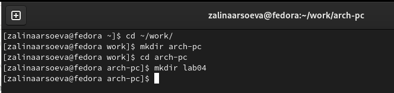{ #fig:001 width=70% }

2. Перехожу в созданный каталог

**cd ~/work/arch-pc/lab05**

(рис. [-@fig:002])

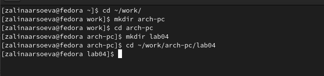{ #fig:002 width=70% }

3. Создаю текстовый файл с именем hello.asm

**touch hello.asm**

(рис. [-@fig:003])

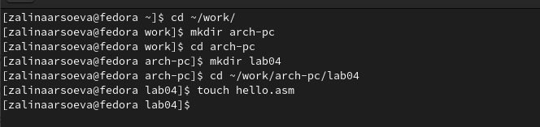{ #fig:003 width=70% }

4. Открываю этот файл с помощью VS Code и ввожу в него следующий текст:
(рис. [-@fig:004])

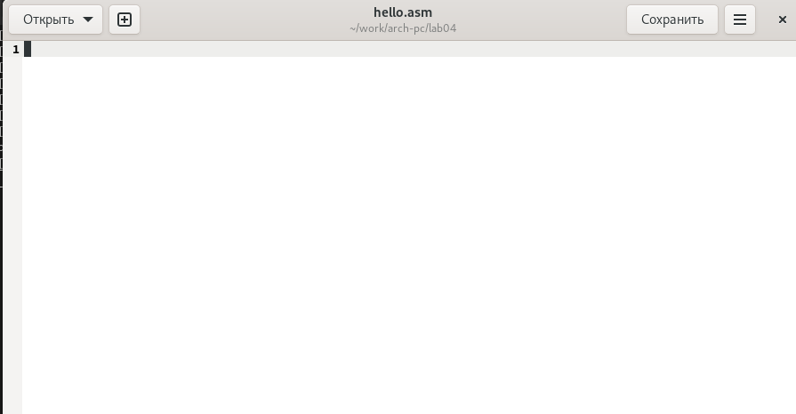{ #fig:004 width=70% }

5. Для компиляции приведённого выше текста программы «Hello World» ввожу:

**nasm -f elf hello.asm**

(рис. [-@fig:005])

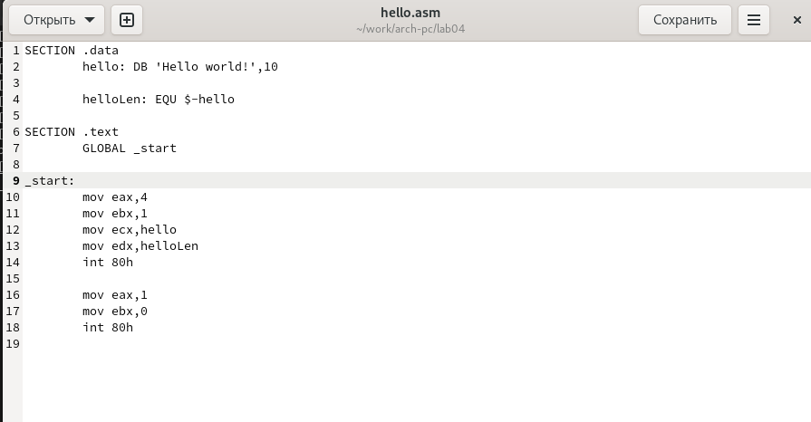{ #fig:005 width=70% }

6. С помощью команды ls проверяю, что объектный файл был создан.

(рис. [-@fig:006])

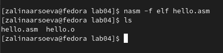{ #fig:006 width=70% }

7. Выполняю следующую команду:

**nasm -o obj.o -f elf -g -l list.lst hello.asm**

(рис. [-@fig:007])

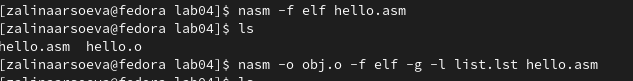{ #fig:007 width=70% }

8. Чтобы получить исполняемую программу, объектный файл необходимо передать на обработку компоновщику:

**ld -m elf_i386 hello.o -o hello**

(рис. [-@fig:008])

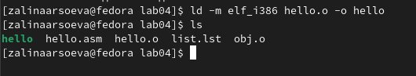{ #fig:008 width=70% }

9. С помощью команды ls проверяю, что исполняемый файл hello был создан

(рис. [-@fig:009])

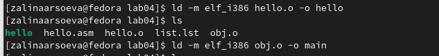{ #fig:009 width=70% }

10. Выполняю следующую команду:

**ld -m elf_i386 obj.o -o main**

(рис. [-@fig:010])

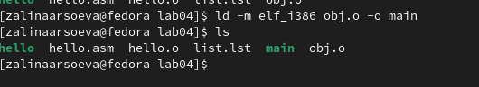{ #fig:010 width=70% }

11. Запускаю на выполнение созданный исполняемый файл, находящийся в текущем каталоге, можно, набрав в командной строке:

**./hello**

(рис. [-@fig:011])

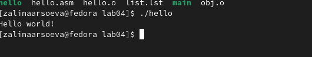{ #fig:011 width=70% }

# Задание для самостоятельной работы

1. В каталоге ~/work/arch-pc/lab05 с помощью команды cp создаю копию
файла hello.asm с именем lab5.asm (рис. [-@fig:012])

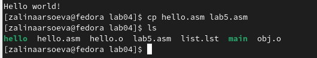{ #fig:012 width=70% }

2. С помощью любого текстового редактора вношу изменения в текст про-
граммы в файле lab5.asm так, чтобы вместо Hello world! на экран выво-
дилась строка с моими фамилией и именем. (рис. [-@fig:013])

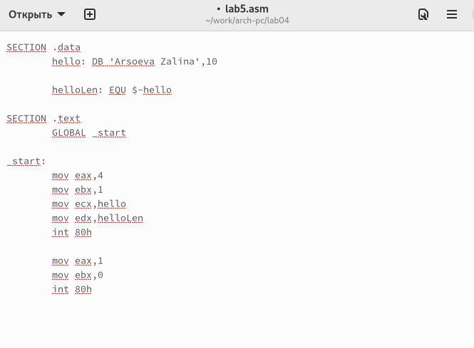{ #fig:013 width=70% }

3. Оттранслирую полученный текст программы lab5.asm в объектный
файл. Выполняю компоновку объектного файла и запускаю получивший-
ся исполняемый файл. (рис. [-@fig:014])

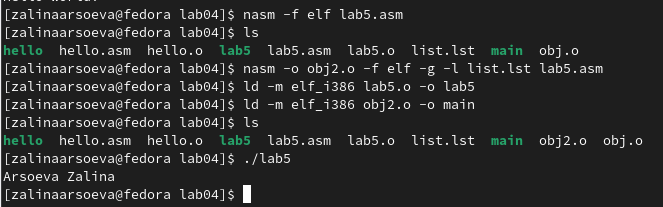{ #fig:014 width=70% }

4. Копирую файлы hello.asm и lab5.asm в локальный репозиторий
в каталог ~/work/study/2022-2023/"Архитектура компьютера"/arch-
pc/labs/lab05/. Загружаю файлы на Github (рис. [-@fig:015])

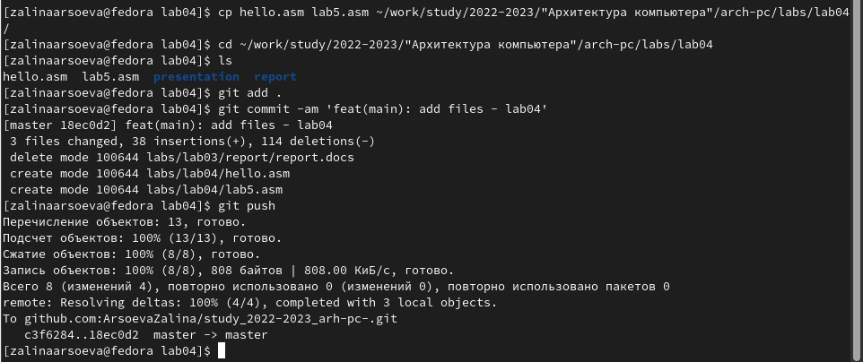{ #fig:015 width=70% }

# Выводы

Я освоила процедуры компиляции и сборки программ, написанных на ассем-
блере NASM.

# Список литературы{.unnumbered}

::: {#refs}
:::
