---
## Front matter
title: "Лабораторная работа No5."
subtitle: "Основы работы с Midnight Commander (mc). Структура программы на языке ассемблера NASM. Системные вызовы в ОС GNU Linux"
author: "Арсоева Залина НБИбд-01-21"

## Generic otions
lang: ru-RU
toc-title: "Содержание"

## Bibliography
bibliography: bib/cite.bib
csl: pandoc/csl/gost-r-7-0-5-2008-numeric.csl

## Pdf output format
toc: true # Table of contents
toc-depth: 2
lof: true # List of figures
lot: true # List of tables
fontsize: 12pt
linestretch: 1.5
papersize: a4
documentclass: scrreprt
## I18n polyglossia
polyglossia-lang:
  name: russian
  options:
	- spelling=modern
	- babelshorthands=true
polyglossia-otherlangs:
  name: english
## I18n babel
babel-lang: russian
babel-otherlangs: english
## Fonts
mainfont: PT Serif
romanfont: PT Serif
sansfont: PT Sans
monofont: PT Mono
mainfontoptions: Ligatures=TeX
romanfontoptions: Ligatures=TeX
sansfontoptions: Ligatures=TeX,Scale=MatchLowercase
monofontoptions: Scale=MatchLowercase,Scale=0.9
## Biblatex
biblatex: true
biblio-style: "gost-numeric"
biblatexoptions:
  - parentracker=true
  - backend=biber
  - hyperref=auto
  - language=auto
  - autolang=other*
  - citestyle=gost-numeric
## Pandoc-crossref LaTeX customization
figureTitle: "Рис."
tableTitle: "Таблица"
listingTitle: "Листинг"
lofTitle: "Список иллюстраций"
lotTitle: "Список таблиц"
lolTitle: "Листинги"
## Misc options
indent: true
header-includes:
  - \usepackage{indentfirst}
  - \usepackage{float} # keep figures where there are in the text
  - \floatplacement{figure}{H} # keep figures where there are in the text
---

# Цель работы

Приобретение практических навыков работы в Midnight Commander. Освоение
инструкций языка ассемблера mov и int.

# Задание

1. Откройте Midnight Commander

**mc**

2. Пользуясь клавишами ↑ , ↓ и Enter перейдите в каталог ~/work/arch-
pc созданный при выполнении лабораторной работы No5

3. С помощью функциональной клавиши F7 создайте папку lab06 и перейдите в созданный каталог.

4. Пользуясь строкой ввода и командой touch создайте файл lab6-1.asm 

5. С помощью функциональной клавиши F4 откройте файл lab6-1.asm для Архитектура ЭВМ редактирования во встроенном редакторе.

6. Введите текст программы из листинга 

7. С помощью функциональной клавиши F3 откройте файл lab6-1.asm для просмотра. Убедитесь, что файл содержит текст программы

8. Оттранслируйте текст программы lab6-1.asm в объектный файл. Выполните компоновку объектного файла и запустите получившийся исполняемый файл. Программа выводит строку 'Введите строку:' и ожидает ввода с клавиатуры. На запрос введите Ваши ФИО.
 **nasm -f elf lab6-1.asm**
 **ld -m elf_i386 -o lab6-1 lab6-1.o**
 **./lab6-1**

9. Скачайте файл in_out.asm со страницы курса в ТУИС.

10. Подключаемый файл in_out.asm должен лежать в том же каталоге, что и файл с программой, в которой он используется.

11. С помощью функциональной клавиши F6 создайте копию файла lab6-1.asm с именем lab6-2.asm. Выделите файл lab6-1.asm, нажмите клавишу  F6 , введите имя файла lab6-2.asm и нажмите клавишу Enter

12. Исправьте текст программы в файле lab6-2.asm с использование подпрограмм из внешнего файла in_out.asm (используйте подпрограммы sprintLF, sread и quit) в соответствии с листингом. Создайте исполняемый файл и проверьте его работу.

13. В файле lab6-2.asm замените подпрограмму sprintLF на sprint. Создайте исполняемый файл и проверьте его работу.

# Задание для самостоятельной работы

1. Создайте копию файла lab6-1.asm. Внесите изменения в программу (без использования внешнего файла in_out.asm), так чтобы она работала по следующему алгоритму:
• вывести приглашение типа “Введите строку:”;
• ввести строку с клавиатуры;
• вывести введённую строку на экран.

2. Получите исполняемый файл и проверьте его работу. На приглашение
ввести строку введите свою фамилию.

3. Создайте копию файла lab6-2.asm. Исправьте текст программы с использование подпрограмм из внешнего файла in_out.asm, так чтобы она работала по следующему алгоритму:
• вывести приглашение типа “Введите строку:”;
• ввести строку с клавиатуры;
• вывести введённую строку на экран
4. Создайте исполняемый файл и проверьте его работу.

# Выполнение лабораторной работы

1. Открываю Midnight Commander

**mc** 

(рис. [-@fig:001])

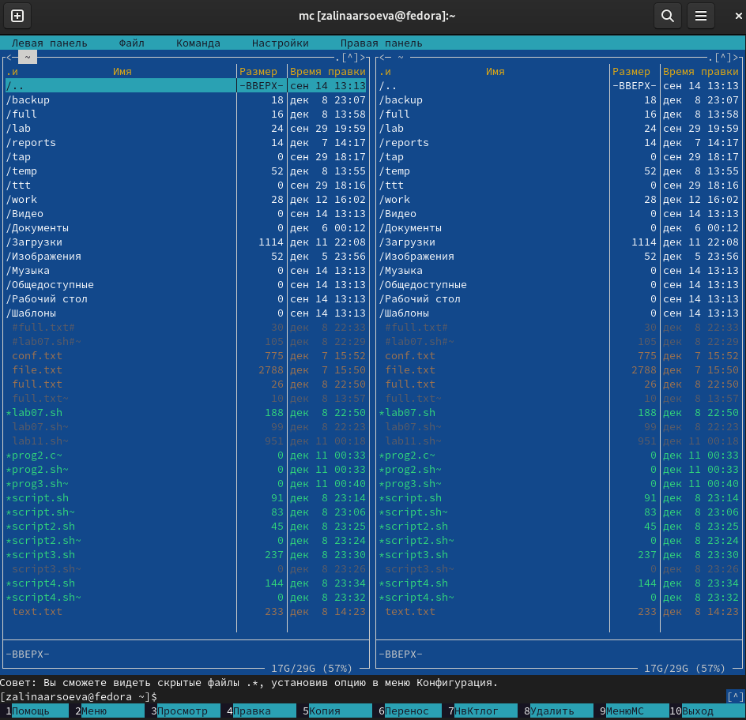{ #fig:001 width=70% }

2. Пользуясь клавишами ↑ , ↓ и Enter перехожу в каталог ~/work/arch-pc созданный при выполнении лабораторной работы No5 (рис. [-@fig:002])

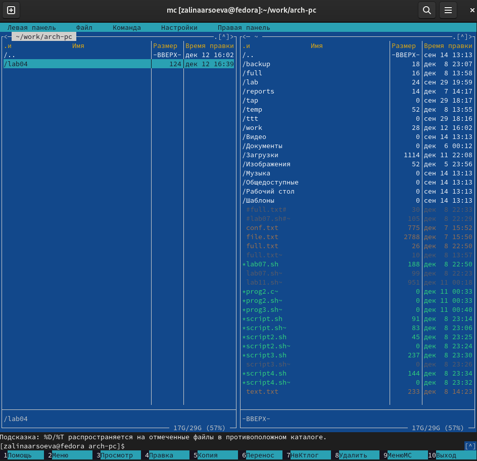{ #fig:002 width=70% }

3. С помощью функциональной клавиши F7 создаю папку lab06 и перехожу в созданный каталог. (рис. [-@fig:003])

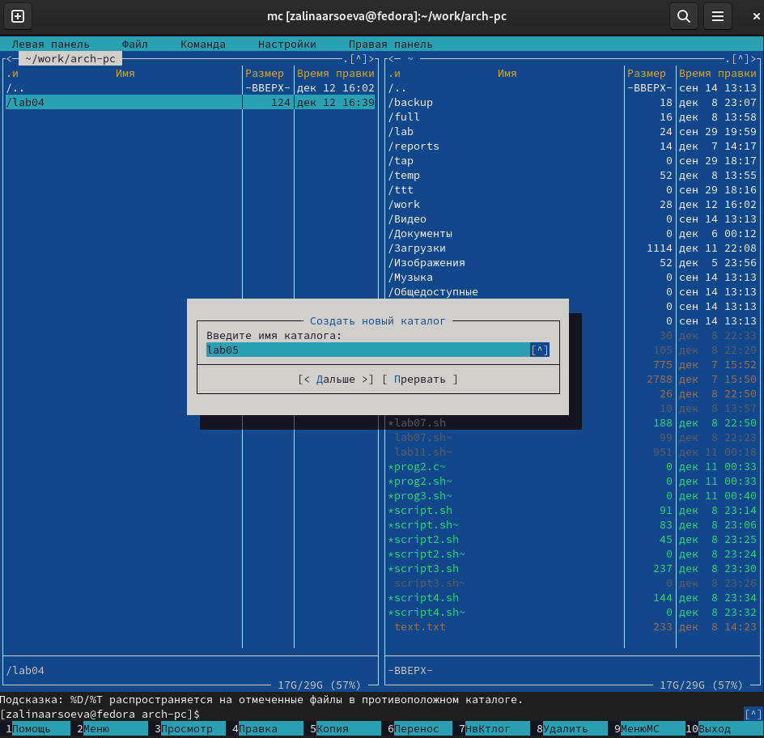{ #fig:003 width=70% }

4. Пользуясь строкой ввода и командой touch создаю файл lab6-1.asm (рис. [-@fig:004])

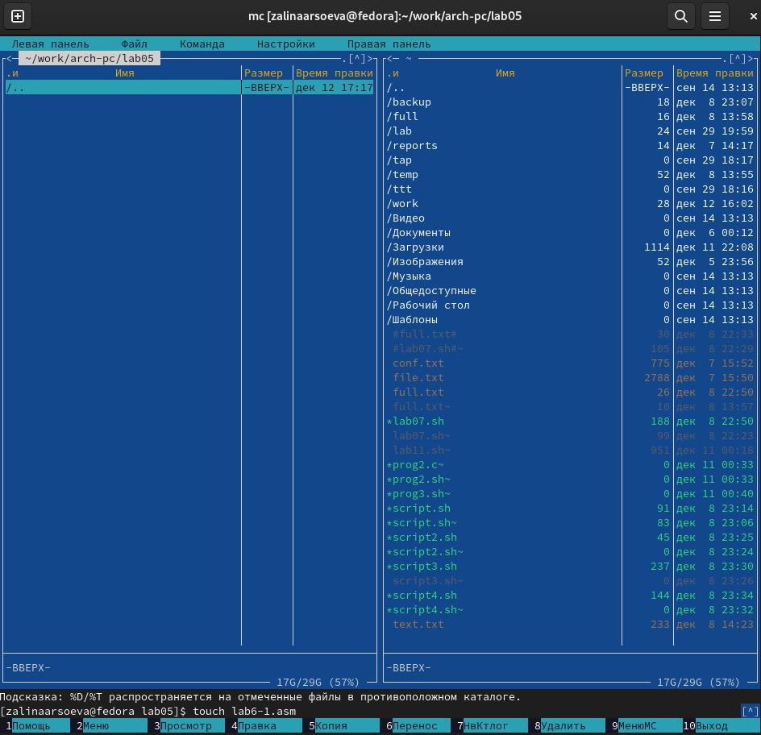{ #fig:004 width=70% }

5. С помощью функциональной клавиши F4 открываю файл lab6-1.asm для Архитектура ЭВМ редактирования во встроенном редакторе. 

6. Ввожу текст программы из листинга. (рис. [-@fig:006])

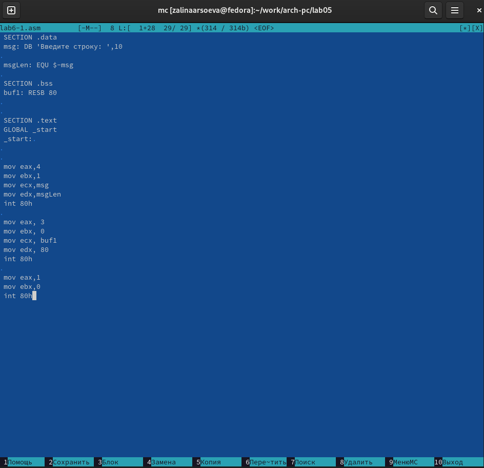{ #fig:006 width=70% }

7. С помощью функциональной клавиши F3 открываю файл lab6-1.asm для просмотра. Убеждаюсь, что файл содержит текст программы (рис. [-@fig:007])

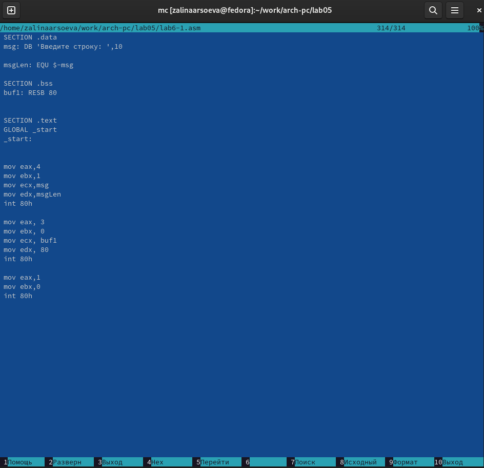{ #fig:007 width=70% }

8. Оттранслирую текст программы lab6-1.asm в объектный файл. 
(рис. [-@fig:008])

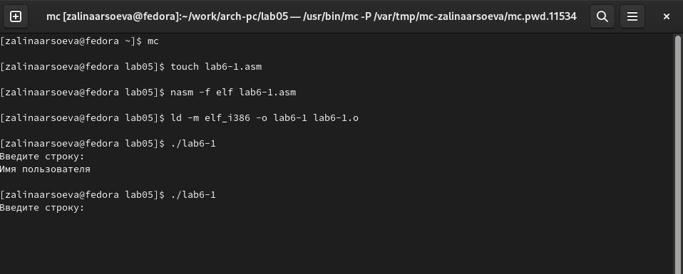{ #fig:008 width=70% }

9. Скачала файл in_out.asm со страницы курса в ТУИС. (рис. [-@fig:009])

{ #fig:009 width=70% }

10. С помощью функциональной клавиши F6 создаю копию файла lab6-1.asm с именем lab6-2.asm. (рис. [-@fig:010])

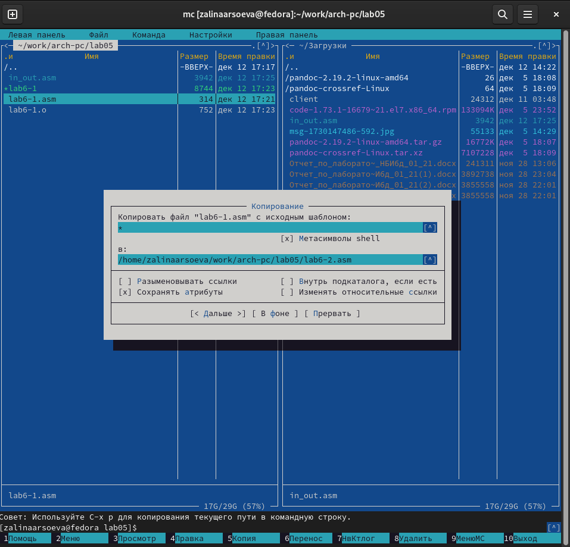{ #fig:010 width=70% }

11. Исправляю текст программы в файле lab6-2.asm с использование подпрограмм из внешнего файла in_out.asm (используйте подпрограммы sprintLF, sread и quit) в соответствии с листингом. Создаю исполняемый файл и проверяю его работу. (рис. [-@fig:011])

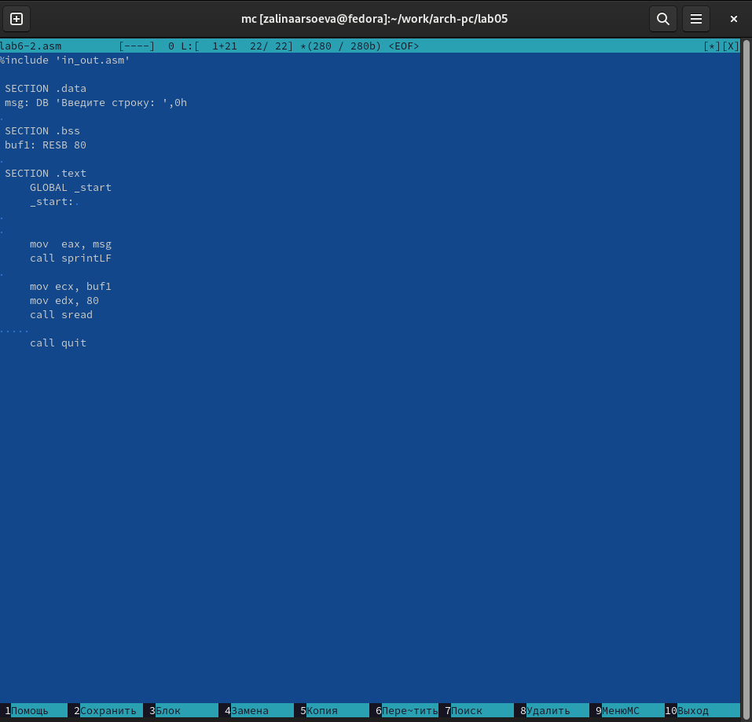{ #fig:011 width=70% }.

# Выполнение задания для самостоятельной работы

1. Создаю копию файла lab6-1.asm. Вношу изменения в программу (без использования внешнего файла in_out.asm), так чтобы она работала по следующему алгоритму:
• вывести приглашение типа “Введите строку:”;
• ввести строку с клавиатуры;
• вывести введённую строку на экран. (рис. [-@fig:012])

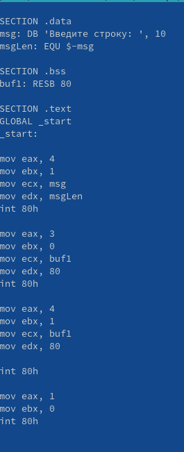{ #fig:001 width=70% }.

2. Получаю исполняемый файл и проверяю его работу. 
(рис. [-@fig:013])

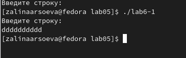{ #fig:013 width=70% }.

3. Создаю копию файла lab6-2.asm. Исправляю текст программы с использование подпрограмм из внешнего файла in_out.asm, так чтобы она работала по следующему алгоритму:
• вывести приглашение типа “Введите строку:”;
• ввести строку с клавиатуры;
• вывести введённую строку на экран
(рис. [-@fig:014])

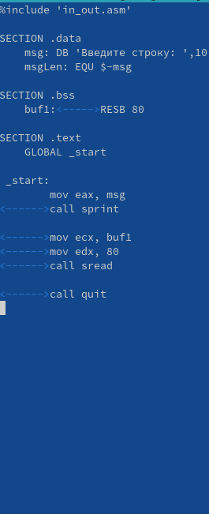{ #fig:014 width=70% }.

4. Создаю исполняемый файл и проверяю его работу.
(рис. [-@fig:015])

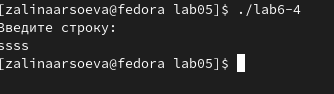{ #fig:015 width=70% }.

# Выводы

Приобретение практических навыков работы в Midnight Commander. Освоение инструкций языка ассемблера mov и int.
