---
## Front matter
title: "Лабораторная работа No6"
subtitle: "Арифметические операции в NASM."
author: "Арсоева Залина НБИбд-01-21"

## Generic otions
lang: ru-RU
toc-title: "Содержание"

## Bibliography
bibliography: bib/cite.bib
csl: pandoc/csl/gost-r-7-0-5-2008-numeric.csl

## Pdf output format
toc: true # Table of contents
toc-depth: 2
lof: true # List of figures
lot: true # List of tables
fontsize: 12pt
linestretch: 1.5
papersize: a4
documentclass: scrreprt
## I18n polyglossia
polyglossia-lang:
  name: russian
  options:
	- spelling=modern
	- babelshorthands=true
polyglossia-otherlangs:
  name: english
## I18n babel
babel-lang: russian
babel-otherlangs: english
## Fonts
mainfont: PT Serif
romanfont: PT Serif
sansfont: PT Sans
monofont: PT Mono
mainfontoptions: Ligatures=TeX
romanfontoptions: Ligatures=TeX
sansfontoptions: Ligatures=TeX,Scale=MatchLowercase
monofontoptions: Scale=MatchLowercase,Scale=0.9
## Biblatex
biblatex: true
biblio-style: "gost-numeric"
biblatexoptions:
  - parentracker=true
  - backend=biber
  - hyperref=auto
  - language=auto
  - autolang=other*
  - citestyle=gost-numeric
## Pandoc-crossref LaTeX customization
figureTitle: "Рис."
tableTitle: "Таблица"
listingTitle: "Листинг"
lofTitle: "Список иллюстраций"
lotTitle: "Список таблиц"
lolTitle: "Листинги"
## Misc options
indent: true
header-includes:
  - \usepackage{indentfirst}
  - \usepackage{float} # keep figures where there are in the text
  - \floatplacement{figure}{H} # keep figures where there are in the text
---

# Цель работы

Освоение арифметических инструкций языка ассемблера NASM.

# Задание

# Символьные и численные данные в NASM

1. Создайте каталог для программам лабораторной работы No 7, перейдите в него и создайте файл lab7-1.asm:

**mkdir ~/work/arch-pc/lab07**
**cd ~/work/arch-pc/lab07**
**touch lab7-1.asm**

2. Введите в файл lab7-1.asm текст программы из листинга 7.1.

В данном случае при выводе значения регистра eax мы ожидаем увидеть
число 10. Однако результатом будет символ j. 

3. Далее изменим текст программы и вместо символов, запишем в реги-
стры числа. 

Создайте исполняемый файл и запустите его. Как и в предыдущем случае при исполнении программы мы не получим число 10. В данном случае выводится символ с кодом 10. Пользуясь таблицей ASCII определите какому символу соответствует код 10. Отображается ли этот символ при выводе на экран?

Создайте файл lab7-2.asm в каталоге ~/work/arch-pc/lab07 и введите в него
текст программы из листинга 7.2.

**touch ~/work/arch-pc/lab07/lab7-2.asm**

Создайте исполняемый файл и запустите его.

**nasm -f elf lab7-1.asm**
**ld -m elf_i386 -o lab7-1 lab7-1.o**
**./lab7-1**

В результате работы программы мы получим число 106. В данном случае, как и в первом, команда add складывает коды символов ‘6’ и ‘4’ (54+52=106). 

5. Аналогично предыдущему примеру изменим символы на числа. 

Создайте исполняемый файл и запустите его. Какой результат будет получен
при исполнении программы?

6. Создайте файл lab7-3.asm в каталоге ~/work/arch-pc/lab07:

**touch ~/work/arch-pc/lab07/lab7-3.asm**

Создайте исполняемый файл и запустите его. Результат работы программы должен быть следующим:

**./lab7-3**
Результат: 4
Остаток от деления: 1

Измените текст программы для вычисления выражения 𝑓(𝑥) = (4 ∗ 6 + 2)/5.
Создайте исполняемый файл и проверьте его работу.

7. Создайте файл variant.asm в каталоге ~/work/arch-pc/lab07:

**touch ~/work/arch-pc/lab07/variant.asm**

Создайте исполняемый файл и запустите его. Проверьте результат работы
программы вычислив номер варианта аналитически.

Включите в отчет по выполнению лабораторной работы ответы на следующие вопросы:
1. Какие строки листинга 7.4 отвечают за вывод на экран сообщения ‘Ваш
вариант:’?

2. Для чего используется следующие инструкции? nasm mov ecx, x mov edx, 80 call sread

3. Для чего используется инструкция “call atoi”?

4. Какие строки листинга 7.4 отвечают за вычисления варианта?

5. В какой регистр записывается остаток от деления при выполнении инструкции “div ebx”?

6. Для чего используется инструкция “inc edx”?

7. Какие строки листинга 7.4 отвечают за вывод на экран результата вычислений?

# Задание для самостоятельной работы

1. Написать программу вычисления выражения 𝑦 = 𝑓(𝑥). Программа должна
выводить выражение для вычисления, выводить запрос на ввод значения
𝑥, вычислять заданное выражение в зависимости от введенного 𝑥, выво-
дить результат вычислений. Вид функции 𝑓(𝑥) выбрать из таблицы 6.3
вариантов заданий в соответствии с номером полученным при выполне-
нии лабораторной работы. Создайте исполняемый файл и проверьте его
работу для значений 𝑥1 и 𝑥2 из 6.3

# Выполнение лабораторной работы

1. Создаю каталог для программ лабораторной работы No 7, перехожу в него и создаю файл lab7-1.asm:

**mkdir ~/work/arch-pc/lab07**
**cd ~/work/arch-pc/lab07**
**touch lab7-1.asm**

(рис. [-@fig:001])

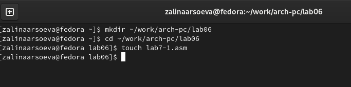{ #fig:001 width=70% }

2. Введите в файл lab7-1.asm текст программы из листинга 7.1.

(рис. [-@fig:002])

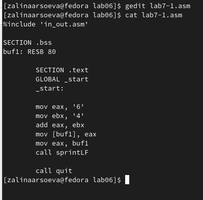{ #fig:002 width=70% }

В данном случае при выводе значения регистра eax мы ожидаем увидеть
число 10. Однако результатом будет символ j. 

(рис. [-@fig:003])

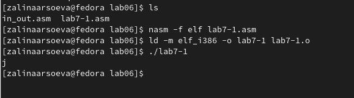{ #fig:003 width=70% }

3. Далее изменим текст программы и вместо символов, запишем в реги-
стры числа. 

(рис. [-@fig:004])

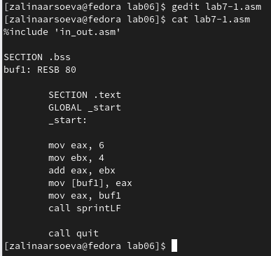{ #fig:004 width=70% }

Создадим исполняемый файл и запустим его. Как и в предыдущем случае при исполнении программы мы не получим число 10. В данном случае выводится символ с кодом 10. (рис. [-@fig:005])

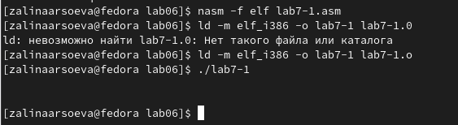{ #fig:005 width=70% }

Создадим файл lab7-2.asm в каталоге ~/work/arch-pc/lab07 и введем в него текст программы из листинга 7.2.

**touch ~/work/arch-pc/lab07/lab7-2.asm**

(рис. [-@fig:006])

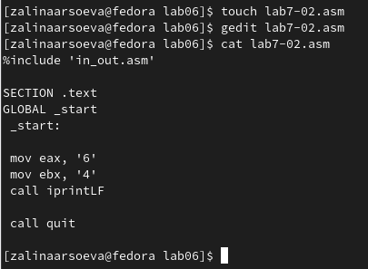{ #fig:006 width=70% }

Создайте исполняемый файл и запустите его.

**nasm -f elf lab7-1.asm**
**ld -m elf_i386 -o lab7-1 lab7-1.o**
**./lab7-1**

В результате работы программы мы получим число 106. В данном случае, как и в первом, команда add складывает коды символов ‘6’ и ‘4’ (54+52=106).

(рис. [-@fig:007])

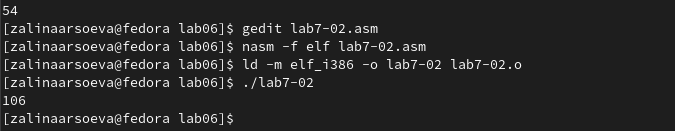{ #fig:007 width=70% }

5. Аналогично предыдущему примеру изменим символы на числа. рис. [-@fig:008])

{ #fig:008 width=70% }

Создадим исполняемый файл и запустим его.  (рис. [-@fig:009])

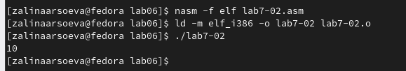{ #fig:008 width=70% }

6. Создадим файл lab7-3.asm в каталоге ~/work/arch-pc/lab07:

**touch ~/work/arch-pc/lab07/lab7-3.asm** (рис. [-@fig:010])

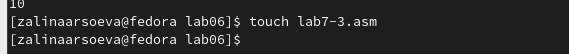{ #fig:010 width=70% }

Создайте исполняемый файл и запустите его. Результат работы программы должен быть следующим:

**./lab7-3**
Результат: 4
Остаток от деления: 1

(рис. [-@fig:011])
(рис. [-@fig:012])

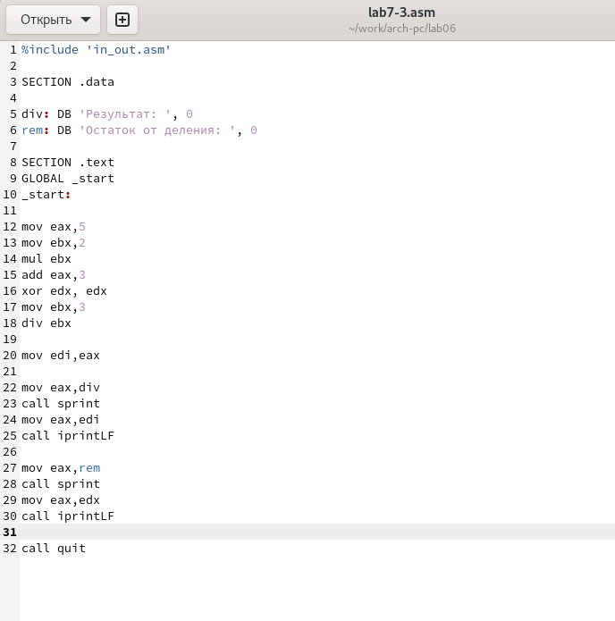{ #fig:011 width=70% }

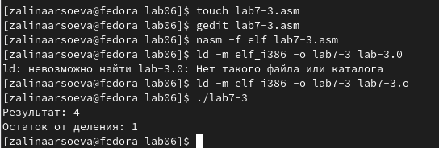{ #fig:012 width=70% }

Изменим текст программы для вычисления выражения 𝑓(𝑥) = (4 ∗ 6 + 2)/5.

(рис. [-@fig:013])

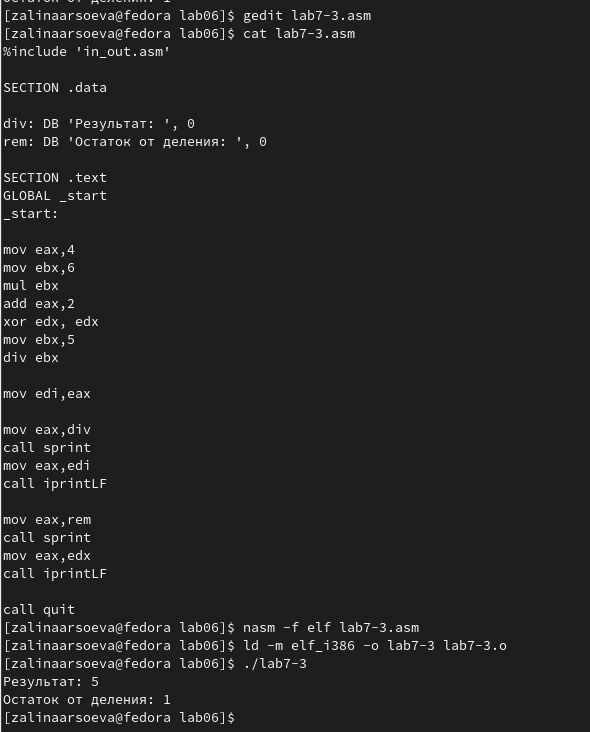{ #fig:013 width=70% }

7. Создадим файл variant.asm в каталоге ~/work/arch-pc/lab07:

**touch ~/work/arch-pc/lab07/variant.asm**

(рис. [-@fig:014])

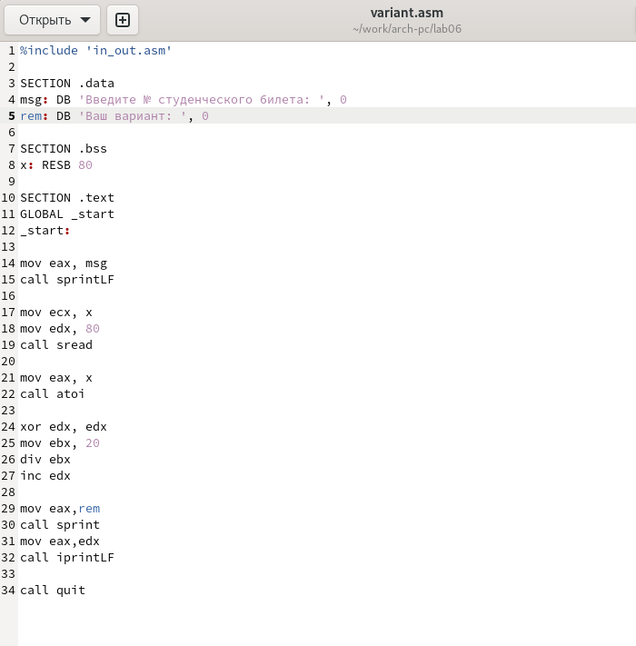{ #fig:014 width=70% }

Создаю исполняемый файл и запускаю его. 

(рис. [-@fig:015])

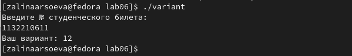{ #fig:015 width=70% }

1. Какие строки листинга 7.4 отвечают за вывод на экран сообщения ‘Ваш
вариант:’? 

mov eax,rem
call sprint

2. Для чего используется следующие инструкции? 
mov ecx, x 
mov edx, 80 
call sread

3. Для чего используется инструкция “call atoi”? 

вызов подпрограммы преобразования ASCII кода в число

4. Какие строки листинга 7.4 отвечают за вычисления варианта?

xor edx,edx
mov ebx,20
div ebx
inc edx

5. В какой регистр записывается остаток от деления при выполнении инструкции “div ebx”?

EDX

6. Для чего используется инструкция “inc edx”?

для прибавления на одну единицу

7. Какие строки листинга 7.4 отвечают за вывод на экран результата вычислений?

mov eax,rem
call sprint
mov eax,edx
call iprintLF

# Выполнение задания для самостоятельной работы

1. Написала программу вычисления выражения 𝑦 = 𝑓(𝑥). Программа должна выводить выражение для вычисления, выводить запрос на ввод значения 𝑥, вычислять заданное выражение в зависимости от введенного 𝑥, выводить результат вычислений. Вид функции 𝑓(𝑥) выбрать из таблицы 6.3 вариантов заданий в соответствии с номером полученным при выполнении лабораторной работы. 

(рис. [-@fig:016])

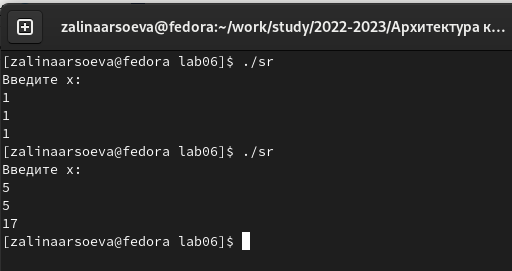{ #fig:016 width=70% }

2. Создала исполняемый файл и проверила его работу для значений 𝑥1 и 𝑥2 из 6.3

(рис. [-@fig:017])

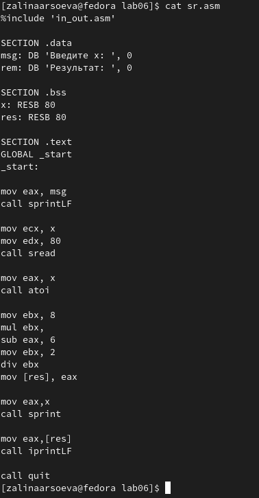{ #fig:017 width=70% }

# Выводы

Я освоила арифметических инструкций языка ассемблера NASM.